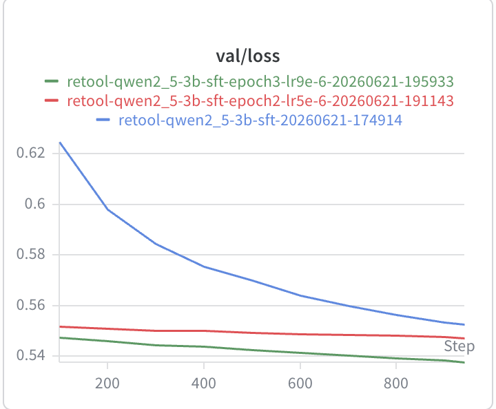
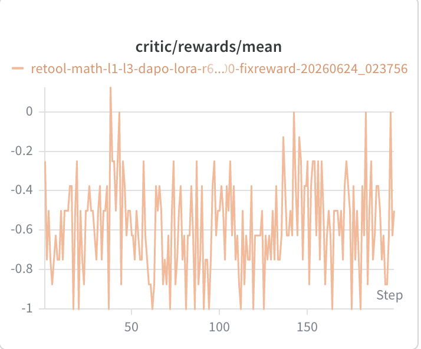
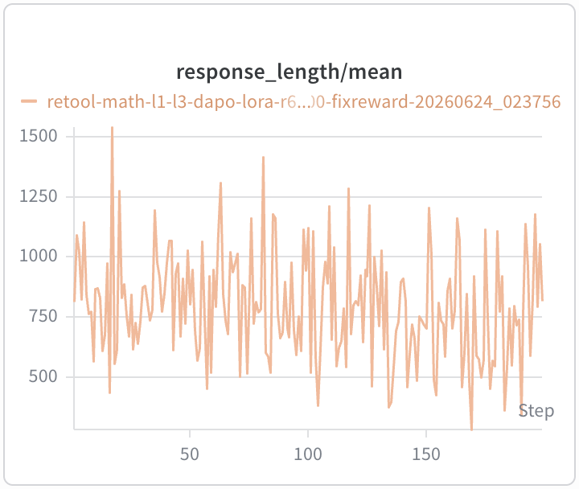
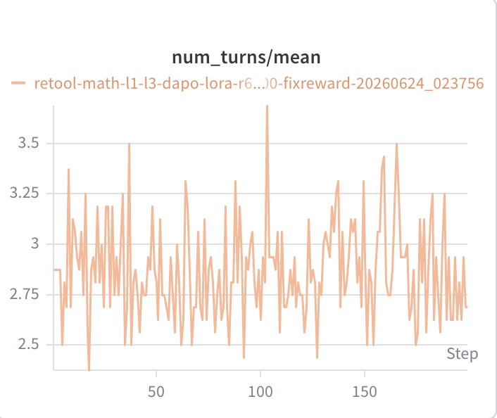

# ReTool：面向代码增强数学推理的 SFT + Sandbox RL 训练链路

## 摘要

本项目实现了一条 ReTool 风格的数学推理训练链路：先用离线 SFT 数据教模型写
Python、读取执行结果并按协议给出答案，再在 veRL 的 RL rollout 中接入真实 Python
sandbox，让模型在生成过程中真正执行代码，并用最终答案 reward 做强化学习。

最终公开产物是融合后的 Hugging Face checkpoint：

```text
retool-math-l1-l3-dapo-lora-r64-global_step_200-fused-hf
```

这份 README 重点记录数据如何构造、训练链路如何闭合，以及目前观察到的核心现象。
正式 AIME/MATH benchmark 还没有完成，因此这里不报告 benchmark 分数。

## 1. 数据管线

这个项目的数据分成两类，服务于两个不同阶段：

```text
SFT 数据：question -> ReTool trace(messages) -> SFT parquet
RL 数据：MATH problem -> prompt-only parquet -> online sandbox rollout
```

二者的核心区别是：SFT 数据包含完整 assistant 轨迹，包括 `<code>`、真实
`<interpreter>` 输出和最终答案标记；RL 数据只提供 prompt 和 ground truth，工具
调用轨迹在训练时由当前策略模型在线生成。本项目新增数据和 RL 推理统一使用
`Answer: <final answer>`。

### 1.1 SFT 数据：离线生成 ReTool 轨迹

SFT 数据位于：

```text
data/sft/train.jsonl
```

每行是 Hugging Face chat messages 格式；仓库中的最终训练文件统一包成
`{"messages": ...}`：

```json
{"messages": [{"role": "user", "content": "..."}, {"role": "assistant", "content": "..."}]}
```

当前训练文件包含 2002 行，主体来自 `JoeYing/ReTool-SFT`，并合入少量本项目生成样例。
外部 ReTool-SFT 主体保留了原始的 ReTool trace 形式，其中部分样本使用
`<answer>\boxed{...}</answer>`；本项目后续生成和 RL 阶段统一收敛到
`Answer: <final answer>` 协议。之前只有 2 行的 smoke 样例已经移除，避免把临时输出
误当成训练集。

本项目自己的 SFT 生成器是 `gen_data.py`。它接受两种输入：单个 `--question`，或者
question-only JSONL。每个输入问题会被填入 `prompts/solve_with_code.txt`，提示生成
模型输出一个完整 ReTool 解题轨迹：

```text
user question
  -> OpenAI-compatible generator
  -> assistant text with <code>...</code>
  -> local Python execution
  -> materialized <interpreter>stdout</interpreter>
  -> final Answer: ...
```

这里最重要的是“materialize interpreter”。生成模型可以写出代码和它认为的输出，
但 `gen_data.py` 不信任这个输出，而是重新执行所有 Python code block：

1. 提取 `<code>```python ... ```</code>`；
2. 用本地 Python 以隔离模式执行代码；
3. 用真实 stdout 覆盖或补齐 `<interpreter>...</interpreter>`；
4. 校验 code/interpreter 是否一一对应；
5. 校验是否只有一个最终 `Answer:` 行，且它是最后一行；
6. 对整数答案，检查最终答案是否和最后一个 interpreter 输出一致。

`gen_data.py` 的原始输出是两条 message 组成的 JSONL list；整理到最终训练集时再包成
`{"messages": ...}`。只有通过校验的样本会写入训练 JSONL；失败样本只写入同名
`.meta.jsonl`，用于后续排查。因此新增 SFT 样本学到的是“可执行代码 + 真实执行结果
+ 最终答案协议”，而不是模型自造的伪 `<interpreter>` 文本。

生成后的 JSONL 还会经过 `scripts/prepare_verl_sft_data.py` 转为 veRL SFT parquet。
这个步骤会用目标模型 tokenizer 套 chat template，过滤超过 `max_length` 的样本，
再按固定 seed 切分 train/val。换句话说，SFT 训练看到的不是原始字符串拼接，而是和
目标 Qwen chat format 对齐后的多轮 messages。

### 1.2 RL 数据：只保留 prompt 与答案

RL 数据定义在：

```text
data/rl/math_l1_l3/
```

它来自 `EleutherAI/hendrycks_math` 的 train split。`scripts/prepare_math_level_data.py`
会遍历 7 个 subject，过滤 level 1 到 3 的题目，并从原始 solution 中提取最后一个
`\boxed{...}` 或 `\fbox{...}` 作为 ground truth。

每个样本被转换成 veRL/DAPO 兼容格式：

```json
{
  "data_source": "math_dapo",
  "prompt": [{"role": "user", "content": "..."}],
  "ability": "MATH",
  "reward_model": {"ground_truth": "...", "style": "rule-lighteval/MATH_v2"},
  "extra_info": {"source": "...", "subject": "...", "level": 3}
}
```

这里刻意不把 ReTool 代码协议写进 parquet prompt。parquet 只保存原始数学任务和
标准答案；真正的 sandbox 使用说明由 `retool_sandbox/verl_agent_loop.py` 在 rollout
时动态注入。这样做的好处是 RL 数据保持干净：数据集描述“要解什么题”，agent loop
描述“怎么用工具解题”。

当前 RL 数据统计如下：

| 字段 | 值 |
| --- | --- |
| dataset | `EleutherAI/hendrycks_math` |
| levels | 1-3 |
| subjects | prealgebra, algebra, number theory, counting/probability, geometry, intermediate algebra, precalculus |
| unique rows before split | 3504 |
| val rows | 128 |
| train rows after repeat | 33760 |
| repeat | 10 |
| seed | 2026 |

按 level 分布：

| level | rows |
| ---: | ---: |
| 1 | 564 |
| 2 | 1348 |
| 3 | 1592 |

按 subject 分布：

| subject | rows |
| --- | ---: |
| prealgebra | 706 |
| algebra | 910 |
| number theory | 369 |
| counting/probability | 329 |
| geometry | 270 |
| intermediate algebra | 526 |
| precalculus | 394 |

生成的 `train.parquet` 和 `val.parquet` 是训练产物，不提交到 git；仓库只提交
`prompt.txt`、`meta.json` 和数据说明。

## 2. 训练管线

训练分两段：SFT 先建立工具使用格式，RL 再把真实工具反馈接入策略优化。

### 2.1 SFT：学习 ReTool 格式

SFT 基座是 Qwen2.5-3B。训练目标不是直接提升 benchmark，而是先让模型稳定学会：

1. 面对数学题时生成自包含 Python code block；
2. 在代码后读取 `<interpreter>` 输出；
3. 最后一行使用统一答案协议 `Answer: <final answer>`；
4. 不把解释写到最终答案行之后。

SFT 后 merged HF checkpoint 为：

```text
/root/autodl-tmp/retool/runs/merged/retool-qwen2_5-3b-sft-epoch3-global_step_941-hf
```

### 2.2 RL：让工具调用进入在线 rollout

RL 从 SFT checkpoint 开始，使用 veRL 的 DAPO/GRPO 风格训练。关键不是让模型在文本里
假装执行代码，而是在 agent loop 中真正暂停生成、运行代码、再把 stdout 写回上下文：

```text
model generates until </code>
  -> AsyncPythonSandboxPool executes Python
  -> stdout is appended as <interpreter>...</interpreter>
  -> model continues generation
  -> reward scores final Answer:
```

`retool_sandbox/verl_agent_loop.py` 负责这条在线工具链路。它在每个 rollout 的用户
prompt 前注入 ReTool 协议，限制单步生成长度、最大模型调用次数和最大工具调用次数，
并把 tool results 写入 rollout dump 以便审计。

最终保留的 RL run：

```text
retool-math-l1-l3-dapo-lora-r64-sandbox-b2-n8-r2048-s50-1000-fixreward-20260624_023756
```

关键配置：

| 字段 | 值 |
| --- | --- |
| base model | epoch-3 SFT merged HF checkpoint |
| mode | LoRA |
| LoRA rank | 64 |
| train batch size | 2 |
| rollout n | 8 |
| max response length | 2048 |
| save freq | 50 |
| final saved step | global_step 200 |

最终公开 checkpoint 来自 `global_step_200`。这是链路打通后的阶段性模型，不应描述成
完整收敛后的最优模型。

## 3. 训练信号

SFT 验证 loss 持续下降：

| 阶段 | 训练步 | final `val/loss` |
| --- | ---: | ---: |
| epoch 1 | global_step 941 | 0.5525964499 |
| epoch 2 | global_step 941 | 0.5473101735 |
| epoch 3 | global_step 941 | 0.5376862288 |



RL 过程中 reward 有区分度，response length 和 turns 也显示 agent loop 在运行：

| step | `critic/score/mean` | `critic/score/max` | `critic/score/min` | `response_length/mean` | `num_turns/mean` |
| ---: | ---: | ---: | ---: | ---: | ---: |
| 50 | -0.625 | 1.0 | -1.0 | 802.75 | 2.8125 |
| 100 | -0.500 | 1.0 | -1.0 | 1122.38 | 2.6250 |
| 150 | -0.250 | 1.0 | -1.0 | 703.69 | 2.9375 |
| 199 | -0.500 | 1.0 | -1.0 | 817.63 | 2.6875 |







这些曲线说明训练、reward、agent loop 和 checkpoint 保存链路是闭合的；它们不是
正式 benchmark 结论。

## 4. 手工对话评测

为了观察模型是否真的把工具反馈纳入推理，我用 `scripts/manual_dialog_eval.py` 跑了
6 道可核验小题。三组模型使用同一个真实 sandbox prompt。

| model | correct | accuracy | tool calls | avg tool calls |
| --- | ---: | ---: | ---: | ---: |
| base Qwen2.5-3B | 1 / 6 | 16.7% | 0 | 0.00 |
| SFT checkpoint | 3 / 6 | 50.0% | 5 | 0.83 |
| RL checkpoint | 4 / 6 | 66.7% | 7 | 1.17 |

逐题结果：

| question | expected | base | SFT | RL |
| --- | ---: | ---: | ---: | ---: |
| `sum_1_to_100` | 5050 | 5050 | 5050 | 5050 |
| `stairs_6_steps_123` | 24 | 20 | missing answer | 21 |
| `mod_17017_power` | 1 | 11 | 1 | 1 |
| `square_divisors` | 24 | 12 | 24 | 24 |
| `ordered_gcd_pairs` | 19 | 10 | 25 | 25 |
| `digit_sum_to_500` | 30 | 10 | 28 | 30 |

最重要的不是 6 题准确率，而是 `digit_sum_to_500` 暴露出的行为变化。RL 模型先用
组合计数得到错误中间结论 `372`，随后主动调用 sandbox 枚举，读到
`<interpreter>30</interpreter>`，最终把答案改成 30：

````text
So, the total is 372.

But wait, let me verify with code.

<code>
```python
count = 0
for n in range(1, 501):
    digit_sum = sum(int(d) for d in str(n))
    if digit_sum == 7:
        count += 1
print(count)
```
</code>
<interpreter>30</interpreter>

The code output is 30. So, the answer is 30.
````

这个现象是当前最核心的结果：RL 不只是让模型“会写代码块”，而是在强化“用外部执行
结果覆盖错误先验”的行为。

同时，`ordered_gcd_pairs` 说明边界也很清楚：模型调用了 sandbox，但代码没有真正
检查 `gcd(a, b) == 6`，所以 sandbox 忠实执行了错误建模，最终仍错成 25。也就是说，
sandbox 能验证代码执行结果，不能保证代码表达了正确数学问题。

## 5. Checkpoint

最终 checkpoint 已发布为 GitHub Release：

```text
https://github.com/flower418/retool/releases/tag/retool-rl-gs200-fused-hf
```

恢复说明和 checksum 见：

```text
docs/checkpoints.md
```

## 6. 边界

1. 当前结果主要来自训练日志和小规模手工对话，还没有正式 AIME/MATH benchmark。
2. reward 依赖最终答案解析，仍可能有错判和漏判。
3. sandbox 只能执行代码，不能自动判断代码是否完整表达原题约束。
4. 当前公开 RL checkpoint 是 `global_step_200` 的阶段性模型。

## 7. 复现入口

正文不展开运行细节，只列入口文件：

| 目标 | 入口 |
| --- | --- |
| 生成 ReTool SFT 样例 | `gen_data.py` |
| 将 SFT messages 转为 veRL parquet | `scripts/prepare_verl_sft_data.py` |
| 准备 MATH level 1-3 RL 数据 | `scripts/prepare_math_level_data.py` |
| SFT 训练 | `scripts/run_verl_sft.sh` |
| Sandbox RL 训练 | `scripts/run_dapo_smoke.sh` |
| 单题真实 sandbox 推理 | `scripts/infer_hf_with_sandbox.py` |
| 三模型手工对话评测 | `scripts/manual_dialog_eval.py` |
| checkpoint 恢复说明 | `docs/checkpoints.md` |
